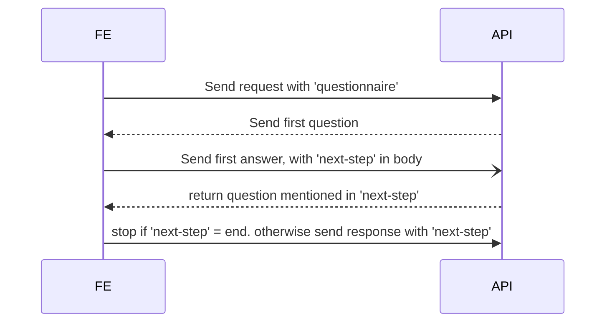

# Plan

How FrontEnd (FE) and API would communicate:

```mermaid
sequenceDiagram
    FE->>API: Send request with 'questionnaire'
    API-->>FE: Send first question
    FE-)API: Send first answer, with 'next-step' in body
    API-->>FE: return question mentioned in 'next-step'
    FE->>API: stop if 'next-step' = end. otherwise send response with 'next-step'

```
